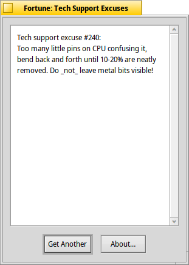

# Fortuna
Fortuna is a nice-looking graphical program which displays a fortune when your system starts. Yeah, sure, there is already a fortune program, but it only shows from the command line you'll get a lot of repeats, it's quite a bit of work to install more, and you have to muck around with your UserBootScript. Lots of messing around. Then again, you can use Fortuna, which has none of this. An add-on pack pack of fortunes is also available for download, so if you like something witty to greet you every time you boot your favorite operating system, you have no excuse now. Now all you need is the fortune cookie to go with it.

(NOTE: Fortunes available in the "fortunes" branch.)
# Screenshot

